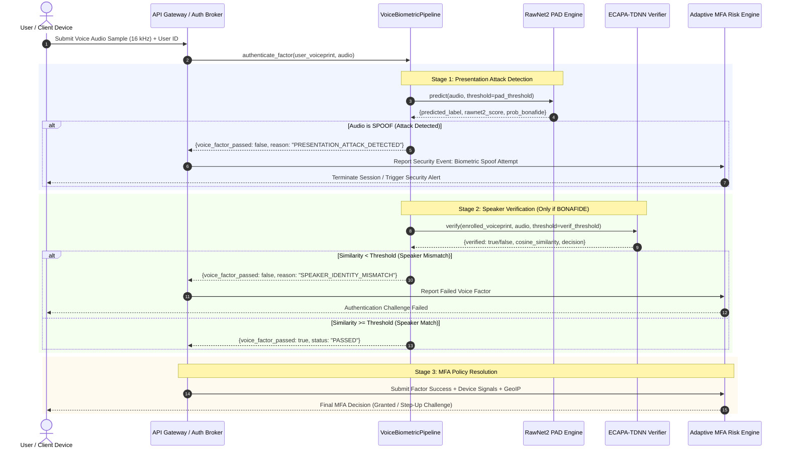
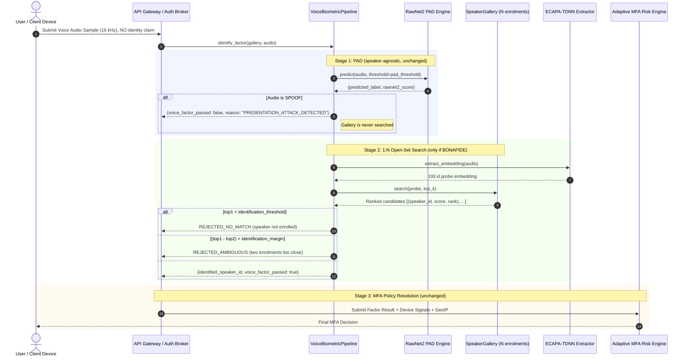

# System Architecture: Voice Biometric Authentication for Adaptive MFA

## 1. Executive Summary

This repository provides the **Voice Biometric Authentication** component for an enterprise **Adaptive Multi-Factor Authentication (MFA)** system. 

Voice authentication combines physical and behavioral acoustic characteristics to verify a user's claim of identity. However, voice biometric systems are susceptible to presentation attacks—including text-to-speech (TTS) synthesis, voice conversion (VC), and recorded replays.

To address this threat model, the system decouples **Presentation Attack Detection (PAD)** from **Speaker Verification (SV)** into a sequential two-stage verification pipeline:

```
Voice Input Audio (16 kHz mono)
         │
         ▼
┌────────────────────────────────────────┐
│   RawNet2 Presentation Attack Detection │
│   (SincConv + ResBlocks + GRU)         │
└───────────────────┬────────────────────┘
                    │
           Is audio BONAFIDE?
           ├── NO (SPOOF)  ──► [REJECT AUTHENTICATION: Presentation Attack Detected]
           │                   (Early exit: prevents unnecessary downstream compute)
           └── YES (BONAFIDE)
                    │
                    ▼
┌────────────────────────────────────────┐
│     ECAPA-TDNN Speaker Verification    │
│  (speechbrain/spkrec-ecapa-voxceleb)   │
└───────────────────┬────────────────────┘
                    │
        Matches Enrolled Voiceprint?
        ├── NO (IMPOSTOR) ──► [REJECT AUTHENTICATION: Speaker Mismatch]
        └── YES (GENUINE) ──► [VOICE MFA FACTOR PASSES]
```

---

## 2. Crucial Security Boundary: Voice Factor ≠ Final Authentication

> [!IMPORTANT]
> **Authentication Scope & Authorization Boundary**:
> A successful voice factor only indicates that the **voice authentication factor passed**; it does **not** by itself constitute final user authentication or authorization.
>
> - **RawNet2 passes + ECAPA-TDNN passes $
ightarrow$ Voice MFA factor passes.**
> - It does **NOT** mean the user is granted access to the underlying application or resource.
> - The broader **Adaptive MFA Risk Engine** aggregates this factor alongside device signals, IP reputation, behavioral heuristics, and time-of-day risk scores before determining the final authentication and authorization policy decision.

---

## 3. Separation of Responsibilities

| Dimension | Stage 1: Presentation Attack Detection | Stage 2: Speaker Verification | Stage 3: MFA Risk Engine |
| :--- | :--- | :--- | :--- |
| **Component** | **RawNet2** | **ECAPA-TDNN** | **Adaptive MFA Policy Engine** |
| **Core Question** | *"Is this audio genuine human speech or a synthetic presentation attack?"* | 1:1 &mdash; *"Does this speech match the enrolled acoustic profile of user $U$?"*<br>1:N &mdash; *"Which of the $N$ enrolled users is this, if any?"* | *"Given all authentication factors and risk context, should access be granted?"* |
| **Model Source** | NTU-ROSE / ASVspoof 2021 Baseline | SpeechBrain (`spkrec-ecapa-voxceleb`) | Contextual Risk Scoring Rules |
| **Input** | 64,600 raw waveform samples (16 kHz mono) | 16 kHz audio waveform | Voice Factor result + contextual signals |
| **Output** | LogSoftmax score $\in [-\infty, 0]$ (Bona Fide log-prob) | 192-d unit embedding $
ightarrow$ Cosine similarity $\in [-1, 1]$ | Policy decision: `ALLOW`, `STEP_UP`, `DENY` |
| **Identity Awareness** | **Zero identity awareness** (speaker-agnostic) | 1:1 &mdash; **identity-specific** (requires a claimed voiceprint)<br>1:N &mdash; **identity-resolving** (searches a `SpeakerGallery`) | Multi-factor correlation |
| **Failure Mode** | Classifies synthetic speech as BONAFIDE (APCER) | 1:1 &mdash; falsely accepts impostor (FAR) or rejects genuine (FRR)<br>1:N &mdash; additionally, accepts a genuine probe under the **wrong** enrolled identity | Security policy violation |

---

## 4. End-to-End Authentication Sequence



---

## 5. Operating Mode: 1:1 Verification vs. 1:N Open-Set Identification

The Voice factor exposes two entry points on `VoiceBiometricPipeline`. Stage 1 (RawNet2 PAD) is identical in both; only Stage 2 differs.

| | 1:1 Verification | 1:N Open-Set Identification |
| :--- | :--- | :--- |
| **Entry point** | `authenticate_factor(enrolled_voiceprint, audio)` | `identify_factor(gallery, audio)` |
| **Identity claim** | Required in advance | None &mdash; resolved from the probe |
| **Stage 2 input** | One 192-d reference vector | `SpeakerGallery` of $N$ enrolled voiceprints |
| **Comparisons** | 1 cosine similarity | $N$ cosine similarities (one matrix-vector product) |
| **Answer** | `GENUINE` / `IMPOSTOR` | A `speaker_id`, or a rejection |
| **Scoring metrics** | FAR, FRR, EER | Rank-N accuracy, CMC, DIR@FPIR |

### 5.1 Identification Sequence



### 5.2 Open-Set Rejection Rationale

A nearest-neighbour search over the gallery **always** returns a closest identity, including for a probe from someone who was never enrolled. Two independent conditions must therefore both hold before an identification is accepted:

1. **Absolute match** &mdash; `top1_score >= identification_threshold`. Rejects unenrolled speakers.
2. **Ranking margin** &mdash; `(top1_score - top2_score) >= identification_margin`. Rejects probes sitting between two enrolments, where a bare argmax would confidently pick the wrong one.

### 5.3 Gallery Size and Threshold Calibration

A 1:1 comparison draws one score from the impostor distribution; a 1:N search draws $N$. Assuming independence, the per-attempt false-match rate grows as `1 - (1 - FAR)^N` &mdash; so a threshold calibrated for 1:1 becomes progressively less safe as enrollment grows. `identification_threshold` is therefore defaulted stricter than the 1:1 threshold, and must be re-validated whenever the gallery scales.

### 5.4 New Failure Mode: Misidentification

1:N introduces a failure with no 1:1 analogue: a **genuine, enrolled** speaker is accepted, but under a **different** enrolled user's identity. In 1:1 this cannot occur &mdash; the claimed identity is fixed, so a wrong match is simply a false accept. In 1:N it is an authentication of the wrong account, and `metrics.open_set_identification_rates()` reports it separately as `misidentification_rate` rather than folding it into the accept rate.

### 5.5 Orchestrator Impact

In the Adaptive MFA architecture, the Authentication Orchestrator currently retrieves *one* user's reference from the User Profile Store before invoking the Voice factor. In 1:N mode it must instead supply a populated `SpeakerGallery`, and the factor returns a resolved `speaker_id` rather than a boolean.

> [!IMPORTANT]
> A returned `identified_speaker_id` is a **biometric claim, not an authenticated session**. The identity boundary in Section 2 applies unchanged: the Adaptive MFA Risk Engine remains responsible for the final authentication and authorization decision.

---

## 6. Architectural Failure Mode Analysis

### 6.1 Presentation Attack (Deepfake / TTS / Voice Conversion)
- **Mechanism**: Attacker submits high-quality neural synthetic speech cloned from the genuine user.
- **Pipeline Handling**: RawNet2 evaluates the raw 1D time-domain waveform through its sinc filters. Artifacts in phase coherence, harmonic decay, and spectral envelope cause the bona fide log-probability to drop below threshold.
- **Outcome**: Early exit. The audio is flagged as `SPOOF`, authentication is terminated, and downstream ECAPA computation is bypassed.

### 6.2 Zero-Effort Impostor Attack (Human Mimic / Wrong Caller)
- **Mechanism**: A human impostor attempts to speak the passphrase or authenticate on behalf of another user.
- **Pipeline Handling**: RawNet2 detects genuine human speech and classifies the utterance as `BONAFIDE`. The sample passes to Stage 2. ECAPA-TDNN extracts a 192-dimensional speaker embedding and compares it against the victim's enrolled voiceprint. The cosine similarity falls well below the verification threshold (mean impostor similarity: 0.1234).
- **Outcome**: The voice factor is rejected with `SPEAKER_IDENTITY_MISMATCH`.

### 6.3 Acoustic Degradation & Channel Mismatch
- **Mechanism**: Genuine user speaks in a noisy environment or through a low-bitrate microphone.
- **Pipeline Handling**: Heavy background noise or clipping may degrade RawNet2 confidence (raising BPCER) or reduce ECAPA cosine similarity.
- **Adaptive Fallback**: Because the voice factor does not execute isolated authorization, the Adaptive MFA risk engine detects the low-confidence voice factor and falls back to an alternative secondary factor (e.g., FIDO2 hardware token or push notification).

---

## 7. Component Orchestration Implementation

In accordance with architectural standards:
- `src/pipeline.py` serves strictly as the orchestration layer between `RawNet2Detector` and `SpeakerVerifier`.
- It does **not** duplicate, modify, or retrain the underlying neural architectures.
- It provides timing instrumentation, standardized failure logging, and factor-level status reporting.
